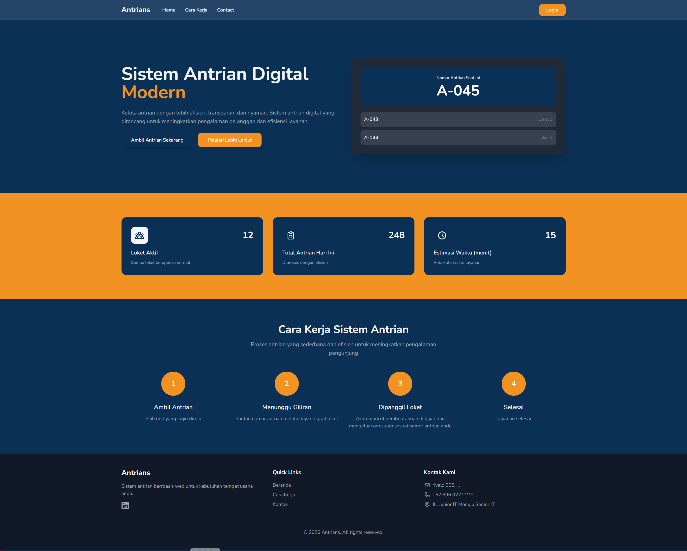
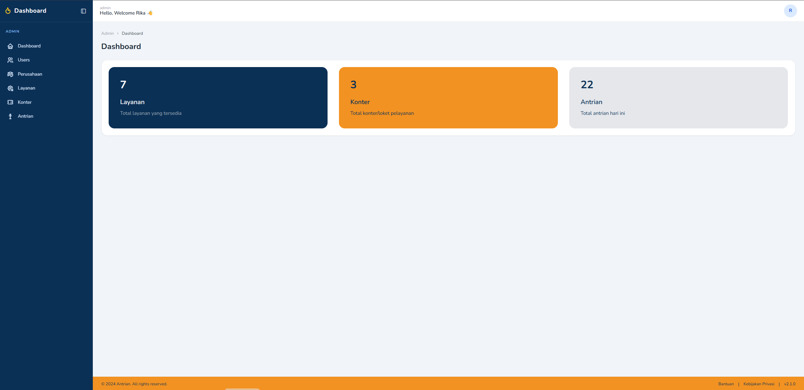
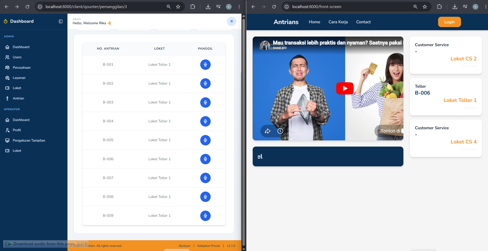
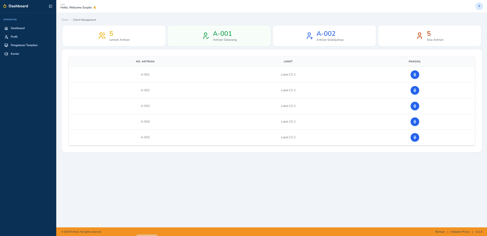
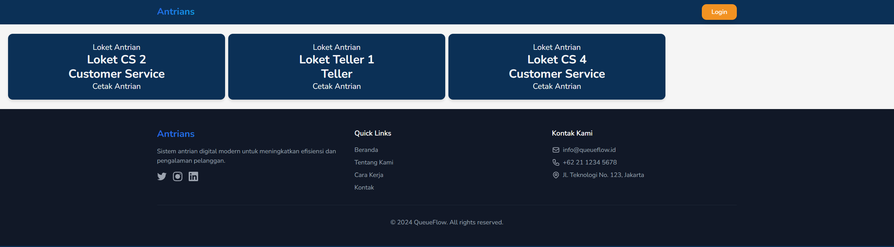
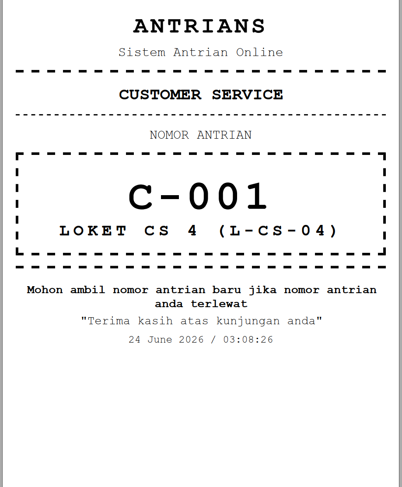
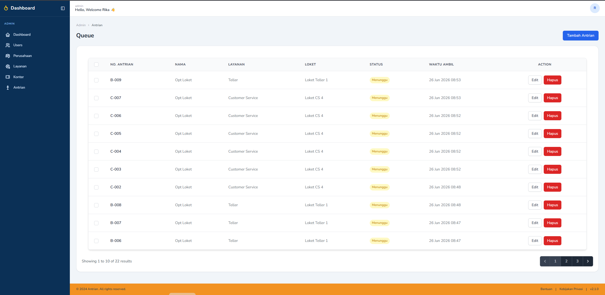
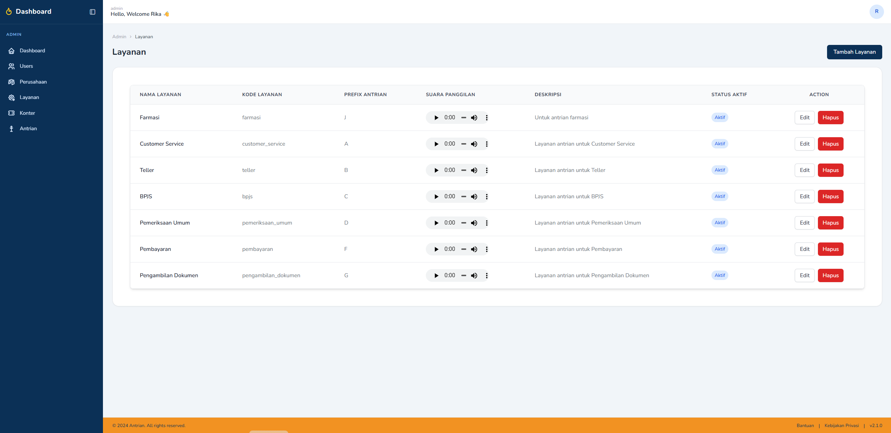
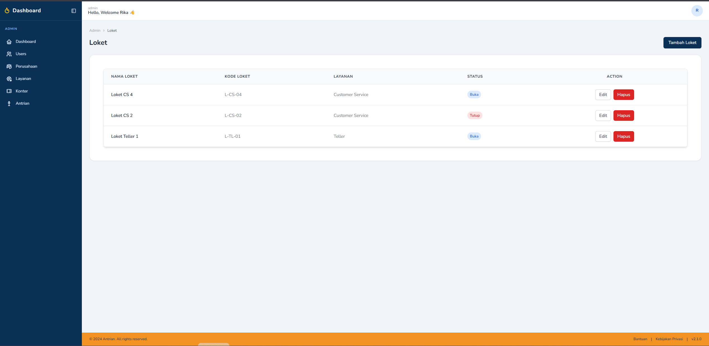

## Aplikasi Antrian Berbasis Laravel

Aplikasi dibuat untuk memudahkan developer untuk mempercepat pembuatan sistem antrian dan memahami alur dari antrian dan cara kerja antrian.
Fitur antrian terdiri dari :

- ✅ Manajemen User.
- ✅ Manajemen Company.
- ✅ Manajemen Layanan.
- ✅ Manajemen Konter.
- ✅ Manajemen Antrian.
- ✅ Login.
- ✅ Register.
- ✅ Halaman Antrian
- ✅ Halaman Panggilan
- ✅ Halaman Print Tiket

## Tech Stack

**Client:**
* 🛠️ **Laravel** 
* 🌬️ **Breeze** 
* ⚡ **Vite** 
* 🔄 **Reverb** 
* 🎨 **TailwindCSS** 

**Server / Package Manager:**
* 📦 **NPM** 


## Tampilan Aplikasi

Berikut adalah beberapa tangkapan layar dari aplikasi yang berjalan:

| Halaman | Gambar |
|---------|--------|
| **Halaman Utama** |  |
| **Halaman Dashboard** |  |
| **Halaman Layar Antrian** |  |
| **Halaman Layar Panggilan** |  |
| **Halaman Cetak Tiket** |  |
| **Hasil Cetak Tiket** |  |
| **Manajemen Antrian** |  |
| **Manajemen Layanan** |  |
| **Manajemen Loket** |  |


## Tata Cara Installasi

-> Download Project github Extract project nya

-> Download folder beserta isi audio melalui link berikut => [Download Here](https://bit.ly/4w9KrZ8)

-> Buat folder dengan nama "audio" di dalam public/

-> pastekan 3 folder ke dalam folder audio yang tadi dibuat

-> Kemudian lakukan installasi selanjutnya dibawah didalam folder project nya

```bash
  composer update / composer install
  npm install   
```

Tahap selanjutnya jalankan php artisan dan npm

```bash
  php artisan key:generate
  php artisan storage:link
  php artisan migrate
  php artisan db:seed
  php artisan reverb:install  
  php artisan reverb:start
  npm run dev
  php artisan serve
```

## Cara kerja pemakaian

-> Step 1 : Masukkan data layanan terlebih dahulu
-> Step 2 : Masukkan Data Loket 
-> Step 3 : Masukkan Data 

Catatan : 

- Jika ingin menggunakan logo pada print silahkan ubah didalam function controller dan input halaman di app/http/controller/   Companycontroller.php dan halaman blade di views/pages/admin/create.blade.php dan views/pages/admin/index.blade.php
- Halaman cetak di views/pages/client/print.blade.php

## 🔗 Links Support Me
[](https://www.linkedin.com/in/rivaldi-idris/)

